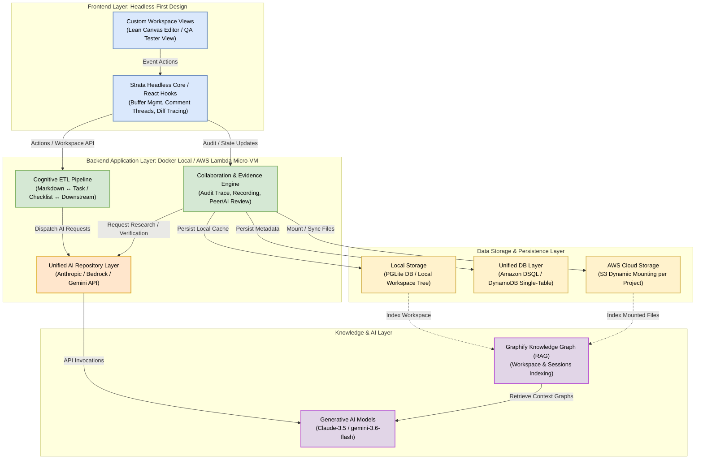

# Strata Layered Architecture

This document describes the foundational layered architecture of **Strata**—the headless framework for human-AI collaborative workspaces. 

To facilitate both immediate design edits and live, interactive modifications, this RFC includes:
1. **Mermaid Flowchart:** A natively-rendered flowchart viewable directly on GitHub.
2. **Draw.io File (`architecture.drawio`):** A fully styled XML template for Diagrams.net / Draw.io located in this directory.

---

## 🎨 1. Natively Rendered Architecture Flowchart (Mermaid)

---

## 📐 2. Layer Specifications (レイヤー構造解説)

### 1. Frontend Layer (フロントエンド層 / Headless-First)
* **Custom Workspace Views:**
  * 特定のデザインを押し付けない「ビューフリー」な設計。各アセット（Lean Canvas、ジャーニーマップ、QAテスト実行、プロセス図など）に応じた専用のWebコンポーネント。
* **Strata Headless Core & React Hooks:**
  * 共同編集、オンラインチャットスレッド、録画バッファ、Gitライクな変更履歴差分（Diff Tracing）など、すべてのプレゼンテーションに共通する「機能と状態管理」をフック化し提供。

### 2. Backend Application Layer (バックエンド・アプリ層 / Ephemeral Runner)
* **Cognitive ETL Pipeline:**
  * AIを用いた双方向データコンバータ。インプットファイルをタスクとチェックリスト（To-Do）にマウントし、作業終了後の履歴を報告書やアンケートデータ、あるいは後工程用マークダウンへ再整形する。
* **Collaboration & Evidence Engine:**
  * 作業内容、チャットメッセージ、レビュー進捗のトラッキング。Web/プロセスの録画やスクリーンショット、システムログ（Evidence）の収集と、第三者検証用ワークフローの実行。
* **Unified AI Repository Layer:**
  * プロバイダ抽象化層。環境変数（`GRAPHIFY_GEMINI_MODEL=gemini-3.6-flash` など）をトリガーに、Claude、Amazon Bedrock、またはGeminiへ安全にリクエストをプロキシ。

### 3. Knowledge & AI Layer (ナレッジ＆AI層 / Context Provider)
* **Graphify Knowledge Graph (RAG):**
  * アップロードされた文書、セッションチャット履歴、タスク作業ログをすべて「知識グラフ（ナレッジグラフ）」として一括RAG化。
  * ClaudeやGeminiエージェントが必要とする情報を最短のホップ数（Graph query / explain）で最速ロード可能にする。
* **Generative AI Models:**
  * 自律型リサーチ（アーリーアダプター調査、ペルソナ構築、バグ分析）やドキュメント変換、レビュー検証の意思決定を実行する知能コア。

### 4. Data Storage & Persistence Layer (データストレージ＆永続化層)
* **Local Storage:**
  * ローカルホスティング時（Docker等）における、ファイルマウントおよびインブラウザSQLエンジンである **PGLite** / SQLite によるローカル・ファースト構成。
* **Unified DB Layer:**
  * マルチテナント運用のための分散DB。AWSでの運用を見越した、DynamoDB（Single-Table設計）や、分散トランザクションに強い **Amazon DSQL** への抽象アクセス。
* **AWS Cloud Storage:**
  * ユーザーID、プロジェクトIDに紐づき、ユーザーがタスク実行時にのみ、S3からMicro-VM（AWS Lambda）へ安全にオンデマンドマウントされる作業領域（`Files / Worktree`）。

---

## 🛠️ 3. How to Edit the Draw.io Template (編集方法)

1. `E:\Github\strata\docs\rfcs\architecture.drawio` をローカルまたは [Diagrams.net (Draw.io)](https://app.diagrams.net/) にドラッグ＆ドロップします。
2. カラースキーム、配置、接続、文字サイズなどが100%編集可能な状態で、図がそのまま復元されます。
3. 編集が完了したら、`docs/rfcs/architecture.png` としてエクスポートして格納し、ドキュメントの挿絵として表示させることができます。
